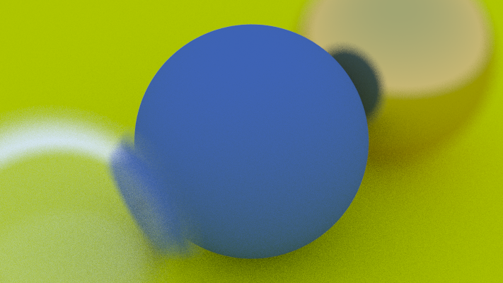

# Raytracer - Full Rendering Engine

A comprehensive ray tracing rendering engine written from scratch in Rust.



## Features

### Materials
- **Lambertian (Diffuse)** - Matte surfaces that scatter light in random directions
- **Metal** - Reflective surfaces with configurable fuzziness
- **Dielectric** - Transparent materials like glass and water with refraction
- **DiffuseLight** - Emissive materials for light sources

### Geometric Primitives
- **Sphere** - Perfect spheres with configurable center and radius
- **Plane** - Infinite planes defined by point and normal
- **Quad** - Parallelograms/rectangles for walls and surfaces
- **Triangle** - Triangle primitives using Möller-Trumbore intersection
- **Cuboid** - Axis-aligned boxes composed of 6 quads

### Camera Features
- **Positionable camera** - lookfrom, lookat, vup vectors
- **Field of view** - Configurable vertical FOV
- **Depth of field** - Defocus blur with configurable aperture and focus distance
- **Builder pattern** - Fluent API for camera configuration

### Performance
- **BVH Acceleration** - Bounding Volume Hierarchy for O(log n) ray-object intersection
- **Multi-threaded rendering** - Parallel scanline processing with Rayon
- **AABB** - Axis-aligned bounding boxes for all primitives

### Output
- **PNG export** - Direct rendering to PNG files
- **PPM support** - Traditional PPM format output

## Usage

```bash
# Build release version
cargo build --release

# Run with default simple scene
./target/release/raytracer

# Run with specific scene
./target/release/raytracer simple output.png
./target/release/raytracer random random_spheres.png
./target/release/raytracer cornell cornell_box.png
```

### Available Scenes

1. **simple** (default) - Three spheres showcasing diffuse, glass, and metal materials with depth of field
2. **random** - Classic random spheres scene with hundreds of small spheres and three large showcase spheres
3. **cornell** - Cornell box scene with colored walls, ceiling light, and two spheres inside

## Building

```bash
# Debug build
cargo build

# Release build (optimized)
cargo build --release

# Run tests
cargo test
```

## Project Structure

```
src/
├── main.rs          # Entry point, scene definitions
├── vec3.rs          # 3D vector math (Point3 alias)
├── ray.rs           # Ray representation
├── color.rs         # Color type with gamma correction
├── camera.rs        # Camera with DOF, positioning, parallel rendering
├── hittable.rs      # Hittable trait, HitRecord, HittableList
├── material.rs      # Material trait + implementations
├── interval.rs      # Range utility
├── constants.rs     # Random number generation, gamma
├── aabb.rs          # Axis-Aligned Bounding Box
├── bvh.rs           # Bounding Volume Hierarchy
└── shapes/
    ├── mod.rs
    ├── sphere.rs
    ├── plane.rs
    ├── quad.rs
    ├── triangle.rs
    └── cuboid.rs
```

## Dependencies

- `rand` - Random number generation
- `rayon` - Parallel iteration
- `image` - PNG output

## Examples

### Creating a Custom Scene

```rust
use raytracer::*;

fn main() {
    let mut world = HittableList::new();
    
    // Add a diffuse sphere
    let material = Arc::new(Lambertian::new(Color::new(0.7, 0.3, 0.3)));
    world.add(Arc::new(Sphere::new(
        Point3::new(0.0, 0.0, -1.0),
        0.5,
        material,
    )));
    
    // Build BVH for acceleration
    let bvh = BvhNode::new(&world);
    
    // Configure camera
    let cam = CameraBuilder::new()
        .image_height(400)
        .samples_per_pixel(100)
        .max_depth(50)
        .vfov(90.0)
        .lookfrom(Point3::new(0.0, 0.0, 0.0))
        .lookat(Point3::new(0.0, 0.0, -1.0))
        .build();
    
    // Render
    cam.render_to_png(&bvh, "output.png");
}
```

## Performance Tips

1. Use release builds (`--release`) for 10-50x faster rendering
2. The BVH acceleration structure makes complex scenes tractable
3. Reduce `samples_per_pixel` for faster preview renders
4. Multi-threading scales well with CPU cores

## License

MIT

## Acknowledgments

Based on the [Ray Tracing in One Weekend](https://raytracing.github.io/) book series by Peter Shirley.
